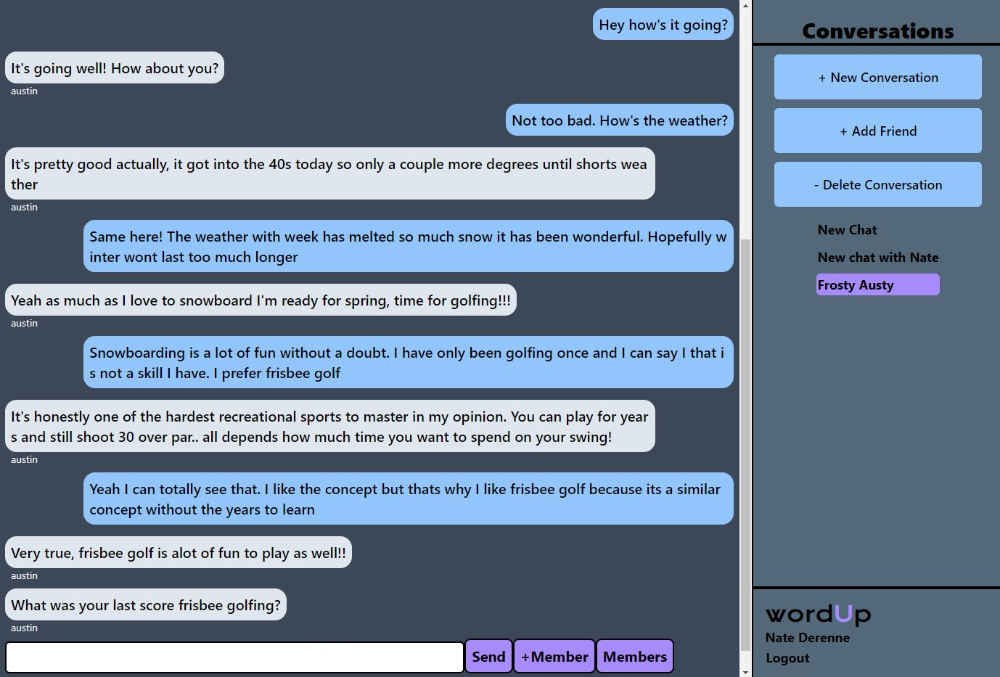
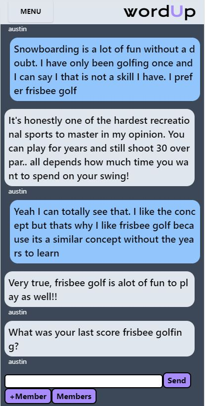
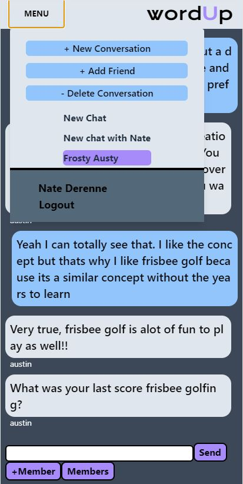

  # wordUp
  

  
  
  ## Description
  wordUp is a real-time chat application for users to communicate with each other over the internet.  The user is able to sign up or login to their profile for personalized chats with other users.  When on the dashboard of the application the user can select current chats that they have, add a new chat, or delete one.  There is an input field along the bottom for the user to send a message as well as add participants and view participants in the selected chat.  There is also an add a friend button that will pop up a modal to add a friend to the user's account. Multiple users can be added to a single chat as long as they are in your friends list. This application was created as a PWA allowing for seamless offline functionality.

  ## Table of Contents
  * [Technologies](#technologies)
  * [Usage](#usage)
  * [License](#license)
  * [Application](#application)
  * [Contributing](#contributing)
  * [Questions](#questions)

  ## Technologies

  **Stack**
  * MERN

  **Front End**
  * React
  * Tailwind CSS
  * Apollo
  * WebSockets
  * Context API
  * IndexedDB
  * Service Worker

  **Back End**
  * Node.js
  * Express.js
  * GraphQL
  * MongoDB
  * Mongoose
  * Apollo Subscriptions
  * JSON web tockens
  * Bcrypt

  ## Images

  ### Mobile Friendly Application

  

  
  

  ## Usage
  To use signup or login then create a new conversation or select a conversation you are part of.  If you made a new conversation, add a participant and start chatting with each other.  Add friends to your profile by hitting the add friend button.

  ## License
  [MIT](https://opensource.org/licenses/MIT)

  ## Application
  Deployed to Heroku at: https://fast-shelf-56121.herokuapp.com/

  ## Contributing
  We are currently closed to any contributions, but if you would like to talk about the application just contact us.
  Current Contributors:  
  * Duncan Marten
  * Nate Derenne
  * Brent Johnson
  * Austin Price

  ## Questions
  * Contact us at [Github](http://www.github.com/DuncanMarten)
